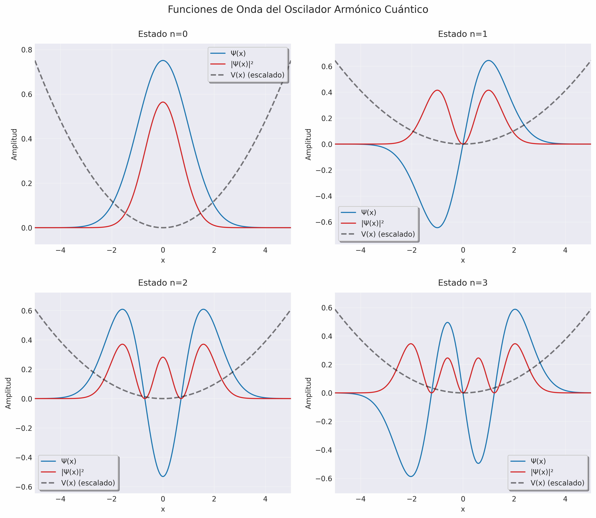

# Solución Numérica del Oscilador Armónico Cuántico mediante el Método de Numerov

## Palabras Clave

Algoritmo de Numerov, Física Cuántica, Mecánica Cuántica, Método Numérico, Oscilador Armónico, Python, C, Visualización de Datos

## Resumen

Se presenta la implementación numérica de la solución del oscilador armónico cuántico utilizando el método de Numerov. El desarrollo incluye la programación en C para el cálculo de las funciones de onda y la visualización de resultados mediante Python. Los resultados obtenidos muestran las funciones propias para los primeros cuatro estados cuánticos (n = 0, 1, 2, 3), junto con sus respectivas densidades de probabilidad.

## Tecnologías utilizadas

- C (cálculos numéricos)
- Python (visualización)
- Matplotlib (generación de gráficas)
- Make (automatización de compilación)

## Introducción

El oscilador armónico cuántico representa uno de los sistemas más fundamentales en mecánica cuántica, descrito por la ecuación de Schrödinger independiente del tiempo:

$$
-\frac{\hbar^{2}}{2m}\frac{d^{2}\psi}{dx^{2}} + V(x)\psi(x) = E\psi(x)
$$

donde $V(x) = \frac{1}{2}m\omega^2x^2$ es el potencial armónico.

## Metodología

### Implementación en C

Se desarrolló un programa en C que implementa el método de Numerov para resolver la ecuación de Schrödinger. Los componentes principales del código incluyen:

1. **Configuración de Parámetros**

   ```c
   const double hbar = 1.0;
   const double masa = 1.0;
   const double omega = 1.0;
   const double x_max = 5.0;
   const double x_min = -5.0;
   const int n_puntos = 1000;
   ```

2. **Funciones Principales**
   - `energia_esperada`: Calcula los niveles de energía teóricos
   - `potencial`: Implementa el potencial armónico
   - `metodo_numerov`: Aplica el algoritmo de Numerov
   - `normalizar`: Normaliza las funciones de onda

### Visualización con Python

Se implementó un script en Python para la visualización de resultados, utilizando matplotlib para generar gráficas de alta calidad. Las gráficas muestran:

- Función de onda Ψ(x)
- Densidad de probabilidad |Ψ(x)|²
- Potencial V(x) escalado

### Sistema de Compilación

Se desarrolló un Makefile multiplataforma que:

- Compila el código C
- Configura un entorno virtual de Python
- Ejecuta los scripts
- Gestiona la visualización de resultados

## Resultados y Discusión

El programa generó exitosamente las funciones de onda para los primeros cuatro estados del oscilador armónico cuántico. La figura 1 muestra los resultados obtenidos.



_Figura 1. Representación de las funciones de onda (Ψ), densidades de probabilidad (|Ψ|²) y potencial escalado para los estados n = 0, 1, 2 y 3 del oscilador armónico cuántico._

Las gráficas muestran las funciones de onda \(\Psi(x)\) y sus respectivas densidades de probabilidad \(|\Psi(x)|^2\) para los primeros cuatro estados \(n = 0, 1, 2, 3\) del oscilador armónico cuántico:

- En el **estado fundamental** (\(n = 0\)), la función de onda es una campana gaussiana centrada en \(x = 0\), sin nodos. La densidad de probabilidad tiene un máximo en el centro, lo que indica que es más probable encontrar la partícula cerca del origen.
- En los **estados excitados** (\(n > 0\)), aparecen \(n\) nodos, es decir, puntos donde la función de onda cruza el eje \(x\). Esto es consistente con la teoría del oscilador armónico cuántico.
- La curva de \(|\Psi(x)|^2\) muestra la densidad de probabilidad, que refleja los puntos de mayor probabilidad de encontrar la partícula en cada estado.
- El potencial \(V(x)\) (representado por la línea punteada) es una parábola, y está escalado para facilitar la comparación visual con las funciones de onda.

## Conclusiones

1. El método de Numerov demuestra ser efectivo para resolver la ecuación de Schrödinger del oscilador armónico cuántico
2. Los resultados numéricos coinciden con las predicciones teóricas para los primeros cuatro estados
3. La implementación multiplataforma permite su ejecución en diferentes sistemas operativos

## Referencias

1. (Documentos/proyecto_01_2024_I.md · Main · Diego Andrés Restrepo Leal / Sistemas Operativos · GitLab, n.d.)
2. (Documentos/oscilador_armonico_cuantico.md · Main · Diego Andrés Restrepo Leal / Sistemas Operativos · GitLab, n.d.)
3. (Documentos/metodo_de_numerov.md · Main · Diego Andrés Restrepo Leal / Sistemas Operativos · GitLab, n.d.)

## Instalación

1. Requisitos previos:

   ```bash
   - Compilador C (gcc)
   - Python 3.x
   - Make
   ```

2. Clonar el repositorio:

   ```bash
   git clone [https://github.com/niespihu12/osciladorArmonicoCuantico.git]
   ```

3. Compilar y ejecutar:
   ```bash
   make all
   ```

## Modo de uso

1. **Compilación y ejecución**:

   ```bash
   make all        # Ejecuta todo el proceso
   make clean      # Limpia los archivos generados
   ```

2. **Visualización de resultados**:
   - Los archivos de datos se generan como `estado_n.txt`
   - La visualización se genera automáticamente como `graficas.png`


## Estructura del código

```
.
├── main.c              # Implementación del método de Numerov
├── main.py             # Visualización de resultados
├── Makefile           # Sistema de compilación
└── requirements.txt    # Dependencias de Python
```


## Contacto

[ Maximiliano ] - [mc349821@gmail.com]
[ Nicolas ] - [niespihu12@gmail.com]

## Licencia

Este proyecto está bajo la Licencia MIT. Ver el archivo [LICENSE](LICENSE) para más detalles.

---

Para cualquier consulta o sugerencia, no dude en contactar al autor.